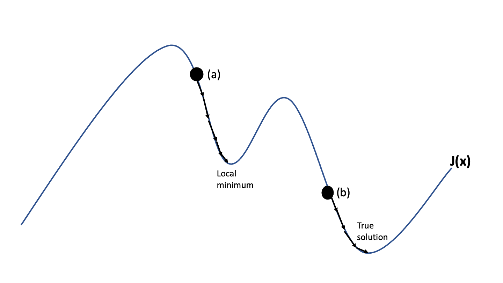

.. _passing-on-to-pydda:

Passing on processed winds to PyDDA
===================================

In this section we will focus on how to make a wind retrieval from preprocessed
Cartesian grids using PyDDA. In order for the techniques in this section to work,
your radar data needs to already be dealiased, cleaned, as well as projected to a 
Cartesian grid. For more information on dealiasing and cleaning the radar data,
please take a look at :ref:`dealiasing-velocities`. In addition, please be sure
to follow the workflow outlined in :ref:`gridding` if your data is in native radar
antenna coordinates. In this example, we will use the same case from MC3E that
is in :ref:`dealiasing-velocities` and :ref:`gridding`, building upon the previous
examples. 

3D Variational technique
------------------------
Now that you have dealiased and gridded radar data, it's now time to use PyDDA to make
the initial wind retrieval. First and foremost, for proper wind retrievals a proper
initial wind field is key. This is because PyDDA retrieves the wind field by finding the minimum
of a cost function :math:`J(v)` that is the penalty term that represents various constraints. 

.. math::
    J(v) = c_mJ_m(v) + c_oJ_o(o) + c_sJ_s(v)

In this example, :math:`J_m(v)` is the amount the wind field violates the mass continuity equation,
:math:`J_o(v)` is the root mean square error between the radar observed winds and the wind field,
and :math:`J_s(v)` is the smoothness cost function that penalizes small scale noise in the retrieval.
PyDDA also includes a background cost function for constraining against sounding data, a model
cost function for constraining against model input data, and a point cost function for constraining
against surface point observtions. For more information about the implementation of these cost functions,
consult :ref:`user`. 

Choosing an initial guess
-------------------------

For miminmizing :math:`J(v)`, an initial guess of the target wind field is required. The above diagram
demonstrates an example of how PyDDA minimizes the cost function, given two 
separate initial guesses. If you chose initial guess (a) in the above example, PyDDA will find the
wind field that enables it to travel in the direction of steepest descent towards the local minumum.
However, once the local minimum is reached, the optimization loop will stop. However, in the above figure,
the true minimum is not located at the local minimum. Hence, we would need to start from a better
initial guess (b) to reach the most physically realistic wind field that we can have.

In order to have a better initial guess of the wind field we will use horizontal winds from the 
nearest sounding in this example.

.. code::

    import pydda
    import pyart

    profile = pyart.io.read_arm_sonde(pydda.tests.SGP_SOUNDING)
    u_init, v_init, w_init = pydda.initialization.make_wind_field_from_profile(grid_sw, profile[1])

Retrieving the winds
--------------------
Once we have set the initial state for the retrieval doing the retrieval is as easy as:

.. code::

    out_grids = pydda.retrieval.get_dd_wind_field([grid_sw, grid_se], u_init, v_init, w_init)

We can quickly visualize the wind field at 3 km using PyDDA's visualization package:

.. code::  

    fig, ax = plt.subplots(1, 1, figsize=(6, 6))
    pydda.vis.plot_horiz_xsection_quiver(out_grids, w_vel_contours=[1, 3, 5, 10])

.. plot::

    import warnings
    import pydda
    import cartopy.crs as ccrs
    import matplotlib.pyplot as plt
    import numpy as np

    import pyart
    from pyart.testing import get_test_data

    warnings.filterwarnings("ignore")

    # read in the data from both XSAPR radars
    xsapr_sw_file = get_test_data("swx_20120520_0641.nc")
    xsapr_se_file = get_test_data("sex_20120520_0641.nc")
    radar_sw = pyart.io.read_cfradial(xsapr_sw_file)
    radar_se = pyart.io.read_cfradial(xsapr_se_file)

    # Calculate the Velocity Texture and apply the PyART GateFilter Utilityx
    vel_tex_sw = pyart.retrieve.calculate_velocity_texture(radar_sw,
                                                           vel_field='mean_doppler_velocity',
                                                           nyq=19
                                                           )
    vel_tex_se = pyart.retrieve.calculate_velocity_texture(radar_se,
                                                           vel_field='mean_doppler_velocity',
                                                           nyq=19
                                                           )

    ## Add velocity texture to the radar objects
    radar_sw.add_field('velocity_texture', vel_tex_sw, replace_existing=True)
    radar_se.add_field('velocity_texture', vel_tex_se, replace_existing=True)

    # Apply a GateFilter
    gatefilter_sw = pyart.filters.GateFilter(radar_sw)
    gatefilter_sw.exclude_above('velocity_texture', 3)
    gatefilter_se = pyart.filters.GateFilter(radar_se)
    gatefilter_se.exclude_above('velocity_texture', 3)

    # Apply Region Based DeAlising Utiltiy
    vel_dealias_sw = pyart.correct.dealias_region_based(radar_sw,
                                                        vel_field='mean_doppler_velocity',
                                                        nyquist_vel=19,
                                                        centered=True,
                                                        gatefilter=gatefilter_sw
                                                        )

    # Apply Region Based DeAlising Utiltiy
    vel_dealias_se = pyart.correct.dealias_region_based(radar_se,
                                                        vel_field='mean_doppler_velocity',
                                                        nyquist_vel=19,
                                                        centered=True,
                                                        gatefilter=gatefilter_se
                                                        )

    # Add our data dictionary to the radar object
    radar_se.add_field('corrected_velocity', vel_dealias_se, replace_existing=True)
    radar_sw.add_field('corrected_velocity', vel_dealias_sw, replace_existing=True)

    grid_limits = ((0., 15000.), (-50000., 50000.), (-50000., 50000.))
    grid_shape = (31, 201, 201)

    grid_sw = pyart.map.grid_from_radars([radar_sw], grid_limits=grid_limits, 
                                     fields=["corrected_reflectivity_horizontal", "corrected_velocity"],
                                     grid_shape=grid_shape, gatefilter=gatefilter_sw,
                                     grid_origin=(radar_sw.latitude["data"], radar_sw.longitude["data"]))
    grid_se = pyart.map.grid_from_radars([radar_se], grid_limits=grid_limits,
                                     fields=["corrected_reflectivity_horizontal", "corrected_velocity"], 
                                     grid_shape=grid_shape, gatefilter=gatefilter_se,
                                     grid_origin=(radar_sw.latitude["data"], radar_sw.longitude["data"]))

    profile = pyart.io.read_arm_sonde(pydda.tests.SGP_SOUNDING)
    u_init, v_init, w_init = pydda.initialization.make_wind_field_from_profile(grid_sw, profile[1])
    out_grids = pydda.retrieval.get_dd_wind_field([grid_sw, grid_se], u_init, v_init, w_init)
    fig, ax = plt.subplots(1, 1, figsize=(6, 6))
    pydda.vis.plot_horiz_xsection_quiver(out_grids, w_vel_contours=[1, 3, 5, 10], ax=ax)
    

In the next section, we will go into more details regarding tuning the coefficents.
